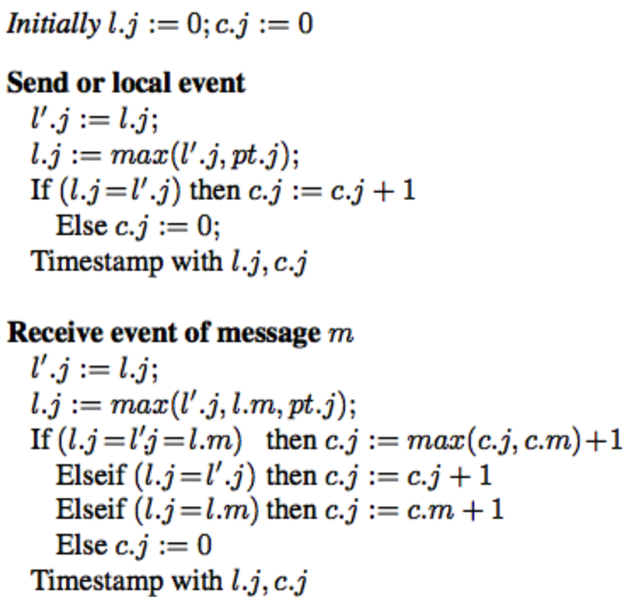

# CockroachDB分布式事务
NewSQL相对传统的分布式SQL数据库可以支持事务，可以支持更丰富的业务场景也是NewSQL受欢迎的原因之一，故分布式事务是NewSQL的核心技术之一。

## 事务隔离级别
在正式介绍CockroachDB分布式事务实现之前，需要明确事务的相关基础知识，事务的[ACID](https://en.wikipedia.org/wiki/ACID_(computer_science))比较基础不在赘述了，其中隔离性在事务并发时会做一些权衡。

#### 事务并发产生的问题
1. 丢失更新：两个事务先后更改一个数据，后一个事务覆盖了前一个事务的更新。
2. 脏读：一个事务读到了另一个未提交的事务数据。
3. 不可重复读：一个事务内多次读一个数据出现了不一致的情况。
4. 幻读：一个事务中增加了一条数据，未提交之前另一个事务读取的数据多了一条。
5. 写倾斜：一个事务读X写Y（写Y需要X作为依据），另一个读Y写X（写X需要Y作为依据），两个事务并发执行（r1Xr2Yw1Yw2X）不等于串行的结果（r1Xw1Yr2Yw2X或者r2Yw2Xr1Xw1）。

#### 隔离级别
在不同的应用场景中并发问题产生的问题有的可能会被接收有的不能，所以针对上述产生的问题对隔离进行了级别区分便于业务在性能和数据准确性上权衡，然后针对不同的隔离级别进行实现。

1. 读未提交：允许脏读取，但不允许更新丢失。如果一个事务已经开始写数据，则另外一个数据则不允许同时进行写操作，但允许其他事务读此行数据。
2. 读已提交：允许不可重复读取，但不允许脏读取。读取数据的事务允许其他事务继续访问该行数据，但是未提交的写事务将会禁止其他事务访问该行。
3. 可重复读：禁止不可重复读取和脏读取，但是有时可能出现幻影数据。读取数据的事务将会禁止写事务(但允许读事务)，写事务则禁止任何其他事务。
4. 序列化：提供严格的事务隔离。它要求事务序列化执行，事务只能一个接着一个地执行，但不能并发执行。

CockroachDB支持两种隔离级别，即SI（snapshot isolation）、SSI（serializable snapshot isolation）。CockroachDB使用的MVCC机制实现的SI（快照隔离级别），但是存在写倾斜问题SSI可以严格的做到序列化的事务隔离级别。

## HLC时钟算法
CockroachDB使用MVCC（多版本控制）实现分布式事务的高并发，需要给每个数据一个版本号。常见的版本号方式有以下几种：
1. 物理时钟：不同机器间存在误差，相同机器也存在跳变的问题。
2. 逻辑时钟：逻辑时钟不能完全反应数据更新的先后顺序，可能后面的事务县访问某个数据版本号小。
3. 向量时钟：一组逻辑时钟的向量，存在偏序关系时可以合并冲突，但是无偏序关系时无法自动合并（Dynamo交个client解决）。
4. 原子钟 + GPS：需要硬件支持（Google Spanner），可以做到集群所有节点时钟严格一致。

HLC时钟使用逻辑时钟 + 物理时钟，伪代码如下：

* 发送数据或者本地更新数据
	* 更新物理时间如果发生跳变选择最大的。
	* 如果时钟发生了跳变更新逻辑时（物理时钟可能无法区分事件的先后顺序）。
* 接收数据
	* 物理时钟更新为当前数据的物理时钟、远程接收的物理时钟、接收事件时刻的物理时钟中最大的（防止物理时钟跳变）。
	* 如果最大的物理时钟 == 当前物理时钟 == 未远程时钟（两台机器存在误差且远程机器时间快于本地）逻辑时钟 = max（远程逻辑时钟，本地逻辑时钟）+ 1（物理时钟无法判断先后顺序时需要借助逻辑时钟）。
	* 如果最大的物理时钟 == 当前物理时钟，逻辑时钟 = 本地逻辑时钟 + 1（本地物理时钟有跳变，且是目前最大的）。
	* 如果最大的物理时钟 == 远程时钟，逻辑时钟 = 远程逻辑时钟 + 1（本地物理时钟跳变否则应该是接收事件时刻的物理时钟）。
	* 不等于当前物理时钟和远程物理时钟，那么就等于本地接收事件时刻的物理时钟，说明物理时钟一直向前，此时将逻辑时钟归0。

## 分布式事务流程
明确了CockroachDB使用HLC时钟算法的MVCC实现了SI和SSI隔离级别的分布式事务背景知识后，下面看一下CockroachDB分布式事务的整体流程：
1. 集群内任意节点接收事务请求（进行词法、语法分析、查询优化等解析为kv操作），该节点成为协调器，协调器将事务信息写入事务表（和普通表一样存在range中）且标记事务状态为off。
2. 协调器按kv粒度与数据节点进行交互完成事务，协调器与数据节点的交互使用两阶段方式，先向节点发送prepare请求
	* 写请求：将更新数据（带有HLC时钟）暂存。
	* 读请求：如果读到了才有暂存的数据，会检查事务的状态如果是off则返回原值，否则返回暂存值。
3. 如果Prepare请求都成功，修改事务表中的状态为on，所有的暂存数据即可生效。
4. 事务完成之后，后台任务异步更是数据为暂存值，如果事务期间有异常会修改事务状态为abort（后台任务删除暂存之）。

## 读写冲突解决方案
明确分布式事务的流程之后下面看一下，CockroachDB是如何实现SI和SSI级别的隔离。

#### 读冲突
T1读数据，此时T2正在更新或者已经更新了数据：
1. T1先启动，且启动时间比T2大很多（超过系统误差），则忽略T2的更新（T2是后面的任务但是先执行完了，读旧数据可以保证SI或者SSI隔离级别）。
2. T1先启动，但启动时间比T2大一点（系统误差以内），T1重试。
3. T2先启动：
	* 若T2已经提交，正确顺序T1直接修改数据。
	* T2尚未提交，且T2是SI隔离级别的事务，T1修改T2的提交时间(push) ，延后提交（存在写倾斜问题，延迟提交防止顺序编程T1T2）。
	* T2尚未提交，且T2是SSI隔离级别的事务，低优先级的事务将被重试。

#### 写冲突
T1写数据：
1. 刚被T2读取过：
	* 如果事务隔离级别为SI，T1事务继续。
	* 如果事务隔离级别为SSI，为避免写倾斜，T1事务重试。
2. T1先启动，但是T2已提交，T1重试（T1继续保证不了SI级别，因为T1T2顺序变成了T2T1）。
3. T2正在写入，低优先级事务重试（两个事务的写冲突）。
	
*注意：以上时间的对比都是HLC时钟。*
