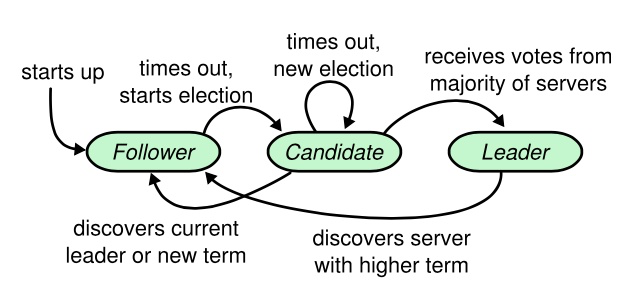
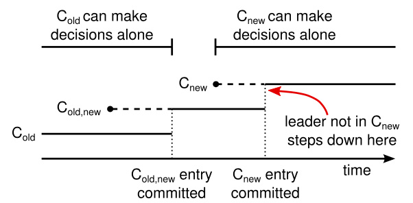

# Raft概述

Raft凭借着简单易懂得到业界青睐，同时Raft论文给出了明确的实现标准也使得Raft的实现有规可循。Paxos论文最受诟病的是晦涩难懂（即使作者后续推出了两篇简易论文描述Paxos），加上没有提出标准的实现导致业界很多基于Paxos的实现都有所改动或者取舍，被认为不是真正或者完美的Paxos实现。

基于以上原因业界在一致性协议的选择中更青睐与Raft，例如：TiDB、CockroachDB等开源项目都选择Raft作为sharding内主从的一致性协议。Raft严格意义上说算是Paxos的一个简化版本，在正常情况下性能与Paxos相当，但是由于增加选主的逻辑使得在主从切换时无法响应用户请求影响可用性，这一点上Paxos的表现会更好一些。本文选取百度开源的braft进行介绍，[braft](https://github.com/joeylichang/braft)基于[brpc](https://github.com/joeylichang/incubator-brpc)实现，在百度内部的生产环境得到了充分的验证，在性能、稳定性、可运维性上更可靠。

## braft
braft是基于Raft论文的工程实现，在工程实践上做了一些完善和优化，主要包括(详细介绍见[BRAFT介绍](https://github.com/brpc/braft/blob/master/docs/cn/raft_protocol.md))：
* pre-vote
	* 网络分区情况下，分区节点会不断尝试提升Term进行选主，在网络恢复正常后会扰乱正常的分组。
	* 增加pre-vote阶段，在选主之前先询问其他节点的是否普有eader。
* transfer leadership
	* 尽量无损的完成主从切换。
* setpeer
	* 设置复制组成员，在极端情况下（只有一个节点正常运行）保证正常服务。
* 指定节点进行Snapshot
	* 指定节点创建Snapshot，其他节点来拉去防止所有节点都创建Snapshot影响消费日志的性能。
* 静默模式
	* 减少节点之间的心跳（一台机器多个分组发送心跳时，网络包成指数级增长）。
* 节点分级
	* 增加一个节点级别，该级别的节点不猜与选主和日志复制，只负责异步拉去某一个节点的日志进行消费（某些业务度量大不要求严格线程一致）。
* pipeline
	* 主从复制使用pipeline方式，提高屯出性能。
* Leader慢节点优化
	* Leader的日志落盘和异步复制给follower并行。
	* 潜在问题是重启之后从落盘读起来的日志可能还没有commited，但是不影响数据一致性，为了防止脏读braft做了处理。
* 本地IO Batch写入

本文主要分以下几部分介绍braft：

在正式介绍braft之前有必要概要性的回顾一下Raft协议的内容，raft的相关资料已经很多了（[raft官网](https://raft.github.io/)、[raft论文](https://raft.github.io/raft.pdf)、[动画演示](http://thesecretlivesofdata.com/raft/)）本文只对协议中核心的部分进行介绍方便后续对braft的源码理解。

## Raft协议概述
### Leader选举
Raft中节点状态转换关系如下图所示：

##### 投票过程
1. 服务器启动时，节点会初始化为追随者状态。
2. 如果一个追随者在一个周期内没有收到心跳信息，就叫做选举超时，开启一轮新的选举。
3. 追随者会自增它的当前任期（Term）并且转换状态为候选人：
	1. 赢得了选举：收到多数节点的投票。
	2. 另一台服务器赢得了选举：收到Term更大的AppendEntries RPC，转为follower。
	3. 选举超时没有选出leader：超时之后立即重试（超时时间带有随机性保证了不会很多节点同时重试）。
4. 新的leader会先发送一个空的AppendEntries RPC 确认leader地位，之后通过AppendEntries RPC（带数据或者空）作为心跳来续期他的Leader地位（重置其他节点的超时时间，超时时间带有一定的随机性，防止多个节点同时发起选举）。

_注意：Term相当于逻辑时钟，每次选举会加1，每个Term内之多有一个leader_

##### 投票请求 RPC（RequestVote RPC）

| 参数 | 解释|
|---|---|
|term| 候选人的任期号|
|candidateId| 请求选票的候选人的 Id |
|lastLogIndex| 候选人的最后日志条目的索引值|
|lastLogTerm| 候选人最后日志条目的任期号|

| 返回值| 解释|
|---|---|
|term| 当前任期号，以便于候选人去更新自己的任期号|
|voteGranted| 候选人赢得了此张选票时为真|

1. 如果req.term < currentTerm，返回false。
2. 如果voteFor为空或者等于req.candudateId，并且req的日志至少比当前节点的新（先比较lastLogTerm在比较lastLogIndex），则返回true。

Term是选举的逻辑时钟，每轮选举之前都会被复制为currentTerm++，如果req.term（候选者的currentTerm++）比当前节点还小说明已经落后至少一个选举的轮次了，应该拒绝其投票。选举的目的是选出数据最新（日志条目最多）的节点，lastLogTerm和lastLogIndex正是日志判断相对新旧的依据，因为leader写请求成功的标志是多数follower响应了leader的AppendEntries RPC（后面日志复制介绍），根据日志的新旧和日志匹配原则（后面介绍）可以保证选出的新leader是持有数据最新的节点，因为不是最新的日志节点会被多数节点（持有最新数据的节点）拒绝。

### 日志复制
##### 日志复制的目标
1. 保证follower节点的日志顺序保持与leader一致。
2. leader决定什么时候follower的日志被状态机执行是安全的。

##### 日志复制模块的流程
1. Leader将client的命令加入到本地的日志中去。
2. 并发向所有的follower发送AppendEntries RPC（超时或者失败会无限重试），follower收到请求会写入本地的日志中。
3. 当leader收到多数followe的回复后，会将日志条目落盘（称为commited），并返回client成功。
4. 如果一个日志是commited那么之前所有的日志都是commited，即使是之前的leader的条目（
	* 选leader机制中保证选择日志最新的节点保证了这点。
5. Leader下次与follower交互时（AppendEntries RPC）会带有最大的commited的log index，如果follower如果有该条日志会在本地状态机执行（_目标2_）。
6. AppendEntries RPC中还会包含之前的条目的索引位置和任期号，如果follower会拒绝这个请求，leader会逐个log回溯发给follwer直到匹配为止（_目标1_）。
	* follower的日志可能会被leader的日志覆盖，例如：follower可能是之前的leader但是日志没有被多数接收就挂了然后重新加入。
	* 选leader机制中保证选择日志最新的节点保证了被多数节点接受的日志不会丢失，保证了即使有日志覆盖也是没有被多数接收的日志被覆盖了，保证了数据的安全性。
	* 通过这种一致性校验的方式，可以看到leader是绝不会删除本地的日志，只有follower的日志才有可能被覆盖。

##### 附加日志远程过程调用 （AppendEntries RPC）

| 参数 | 解释 |
|----|----|
|term| 领导人的任期号|
|leaderId| 领导人的 Id，以便于跟随者重定向请求|
|prevLogIndex|新的日志条目紧随之前的索引值|
|prevLogTerm|prevLogIndex 条目的任期号|
|entries[]|准备存储的日志条目（表示心跳时为空；一次性发送多个是为了提高效率）|
|leaderCommit|领导人已经提交的日志的索引值|

| 返回值| 解释|
|---|---|
|term|当前的任期号，用于领导人去更新自己|
|success|跟随者包含了匹配上 prevLogIndex 和 prevLogTerm 的日志时为真|

### 安全性

安全性的目标，保证任何一个Term内的leader保持之前leader的所有日志（递归可推导出，当前leader持有之前所有的提交的日志保证不会有丢失）。完成这个目标正是依赖前面介绍的两个点：
1. leader收到多数follower的回复后将日志落盘并在本地状态机执行。
2. 选举机制中通过lastLogTerm和lastLogIndex判断选出日志对心的节点为leader。

### Raft核心逻辑总结
目前为止Raft的核心逻辑已经介绍的差不多了（配置变更和快照等逻辑相对独立后面介绍），在这里对Raft协议的性质做一下总结说明并补充一些实现上的具体细节。

##### Raft协议性质
* 选举安全
	* 一个Term内最多一个Leader（可能选举失败）。
* Leader数据只增加不减
	* leader的日志不会删除，只有follower的日志会被覆盖。
* 日志匹配一致性
	* 如果两个日志在相同的索引位置且Term相同，那么这个两个日志从头到该索引位置完全相同。
		* Leader在一个任期里在给定的一个日志索引位置最多创建一条日志条目，同时该条目在日志中的位置也从来不会改变。
		* AppendEntries一致性检查
		* 以上两条可归纳证明日志索引和任期号相同，则之前所有的日志都相同。
* 数据安全
	* 如果一个日志一旦被提交，之后所有的leader都包含这条日志。
* 状态机安全
	* 如果一个日志被状态机执行，那么其他节点该位置的日志不会有不同的日志条目。

##### 数据储存

|状态|所有服务器上持久存在的|
|-------|------|
|currentTerm | 服务器最后一次知道的任期号（初始化为 0，持续递增）|
|votedFor | 在当前获得选票的候选人的 Id|
| log[] | 日志条目集；每一个条目包含一个用户状态机执行的指令，和收到时的任期号 |

|状态|所有服务器上经常变的|
|-------|------|
| commitIndex| 已知的最大的已经被提交的日志条目的索引值|
| lastApplied| 最后被应用到状态机的日志条目索引值（初始化为 0，持续递增）|

| 状态 | 在领导人里经常改变的 （选举后重新初始化）|
|----|--------|
| nextIndex[] | 对于每一个服务器，需要发送给他的下一个日志条目的索引值（初始化为领导人最后索引值加一）|
| matchIndex[] | 对于每一个服务器，已经复制给他的日志的最高索引值|

##### 各角色处理流程
* Follower
	1. 响应来自候选人和领导人的 RPC。
	2. 如果在超过选取Leader时间之前没有收到来自当前领导人的AppendEntries RPC或者没有收到候选人的投票请求，则自己转换状态为Candidate。
* Candidate
	1. 转变为选举人之后开始选举：
		1. currentTerm自增
		2. 给自己投票
		3. 重置选举计时器
		4. 向其他服务器发送RequestVote RPC
	2. 如果收到了来自大多数服务器的投票：成为领导人。
	3. 如果收到了来自新领导人的AppendEntries RPC（heartbeat）：转换状态为追随者。
	4. 如果选举超时：开始新一轮的选举。
* Leader
	1. 向其他所有服务器发送空的AppendEntries RPC（heartbeat）; 在空闲时间重复发送以防止选举超时。
	2. 如果收到来自客户端的请求：向本地日志增加条目，在该条目应用到状态机后响应客户端。
	3. 对于一个追随者来说，如果上一次收到的日志索引大于将要收到的日志索引（nextIndex）：通过AppendEntries RPC将 nextIndex 之后的所有日志条目发送出去，如果发送成功：将该追随者的 nextIndex和matchIndex更新，如果由于日志不一致导致AppendEntries RPC失败：nextIndex递减并且重新发送。
	4. 如果存在一个满足N > commitIndex和matchIndex[i] >= N并且log[N].term == currentTerm的 N，则将commitIndex赋值为 N。
* All
	1. 如果commitIndex > lastApplied，lastApplied自增，将log[lastApplied]应用到状态机。
	2. 如果 RPC 的请求或者响应中包含一个 term T 大于 currentTerm，则currentTerm赋值为 T，并切换状态为Follower。

### 配置变更

Raft提出了一种动态配置变更的方案，通过两阶段的方式引入Cnew,old状态作为中间状态，具体流程：
1. 日志条目（Cnew,old包括新旧两个集群）被复制给集群中新、老配置的所有服务器。
2. 新、旧配置的服务器都可以成为领导人。
3. 达成一致（针对选举和提交）需要分别在两种配置上获得大多数的支持。

Cold、Cnew,old、Cnew的状态转换如图所示：

配置变更期间安全性会得到保证：
1. Leader接收到一个改变配置从 C-old 到 C-new 的请求，会提交C-old,new日志，一旦节点将新的配置日志条目增加到它的日志中，他就会用这个配置来做出未来所有的决定。
2. 这意味着领导人要使用 C-old,new 的规则来决定日志条目 C-old,new 什么时候需要被提交。
3. 如果领导人崩溃了，被选出来的新领导人可能是使用 C-old 配置也可能是 C-old,new 配置，但是C-new 配置在这一时期都不会单方面的做出决定。
4. 一旦C-old,new 被提交，那么无论是 C-old 还是 C-new，在没有经过他人批准的情况下都不可能做出决定，并且领导人完全特性保证了只有拥有 C-old,new 日志条目的服务器才有可能被选举为领导人。
5. 这个时候，Leader创建一条关于 C-new 配置的日志条目并复制给集群就是安全的了。

### Client交互
Raft提供的接口保证线性化，即同一个命令只能执行一次且立即执行，要么成功要么失败。但是存在一下连个问题：
* 写请求：如果领导人在提交了这条日志之后，但是在响应客户端之前崩溃了，那么客户端会和新的领导人重试这条指令，导致这条命令就被再次执行了
	* 解决办法：客户端对于每一条指令都赋予一个唯一的序列号。
* 读请求：Leader响应客户端请求时可能已经被新的领导人作废了，但是他还不知道，导致读到脏数据。
	* 解决办法：Raft 中通过领导人在任期开始的时候提交一个空白的没有任何操作的日志条目到日志，让leader确认已经被提交的所有日志。在响应只读请求之前，先和集群中的大多数节点交换一次心跳信息确认leader是否被作废。
