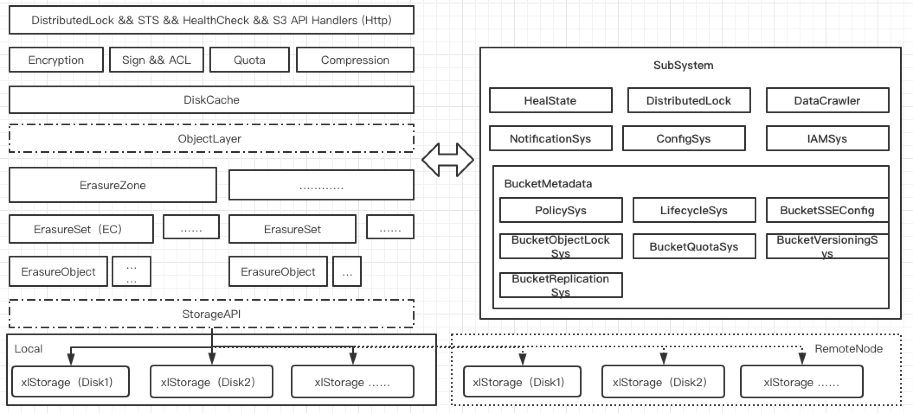
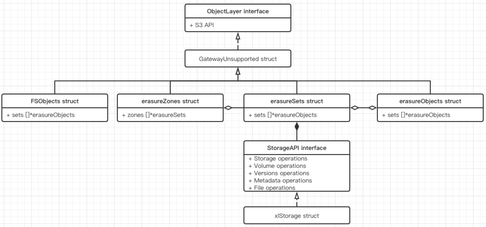

# Min.IO

### 背景

Min.IO 是由 GlusterFS 班底（Anand Babu Periasamy, Harshavardhana等）发起并研发，在设计上能够看出一些相似的理念。Min.IO 在架构上更倾向极简的设计理念，将大规模集群拆分成小的互相独立的分布式集群，在小集群内部避免使用复杂的协调架构，从而分而治之的解决分布式问题。

Min.IO 支持很多种模式：单机模式、纠删码模式、分布式模式等等。本系列文章重点关注可扩展的分布式模式。Min.IO 从架构上看最显著的特点是去中心化，既没有负责元数据维护的模块，从用户角度看最显著的特点兼容 S3 程度非常高。

### 集群架构

如图所示，Min.IO 的分布式架构是一个去中心的架构，每个节点都是存储节点且对等。请求可以被任意的打到任何节点并完成相应的请求返回给客户端。一般会在集群和用户层之间加一层负载均衡的模块，保证集群内每个节点负责均衡，不会出现过热的节点

Min.IO 的元数据作为数据以对象的形式使用纠删码存储在集群内部，对象数据的读写都会使用分布式锁的方式先加锁再写入，然后再解除锁。分布式锁是 Min.IO 实现的 dsync（min.io/pkg 中的库） 特点是轻量快速易用。分布式锁解决了数据读写一致性的问题，详清见[dist_lock](https://github.com/joeylichang/joeylichang.github.io/blob/master/src/minio/subsys/dist_lock.md)。

当集群需要扩容时，会部署同样架构的上述一个小集群，但是两个小集群之间彼此是互通的（通过启动参数，两个小集群是知道各自的节点和拓扑结构的）。多个小集群理论上可以无限扩展，从而完成集群整体的无限扩展。

### Min.IO 特点

##### RS 编码

由于对象存储设计出发点是解决海量存储，甚至相对 KV 类型的存储属于冷存储，对性能不是过分敏感，随着系统和业务发展会演变为成本敏感型的服务，纠删码正式在性能和成本之间一个很好的折中方案。业界很对对象存储也是通过纠删码来节省成本的，例如：AWS S3、百度云（BOS）等。

Min.IO 与 AWS S3 一样使用 RS 编码（纠删码的一种），简单说将数据分成 n 块，根据参数设定额外生成 m 个校验块，一个纠删码分组就是 (n + m) 块磁盘，只要数据丢失损坏少于 m 块，则数据就可以完全恢复。例如：n = 8，m = 4 ，则相当于 1.5副本，通过调整 n 和 m 的值，根据业务和系统实际情况，平衡数据可靠性和成本。

纠删码相较于常见的副本策略就是编解码会消耗 CPU 资源，在性能上自然不如后者（结合对象存储性能不敏感的特点，比较适合），Min.IO 使用的是 [klauspost/reedsolomon](github.com/klauspost/reedsolomon) 库，其在 CPU 层做了汇编级别的优化。

##### Bitrot

位衰减指的是写入磁盘的二进制数据流与读出来的不一致，造成这种现象的原因有很多比如：电磁辐射、磁盘上磁点消失等等，Min.IO 在经过 RS 编码之后还会使用 HighwayHash256S（可配置）对写入磁盘的二进制进行签名，在数据修复或者读出是会利用签名进行验证。

Min.IO 的数据修复（后面介绍）分位两种模式，一种是正常模式分片状态进行校验（纠删码分组，对象级别），另一种是深度模式会使用 HighwayHash256S 进行校验。前者是系统的例行任务，后者必须通过 Http 接口开启（两者均可通过接口开启）。

##### 直接 IO

Min.IO 在设计上都是极简主义，在引擎层也是，一个桶一个目录，桶目录下面若干个对象目录，一个对象目录只有一个对象的数据及其元数据（大对象可能有多个数据文件）。在涉及到所有的所有的磁盘操作时，都是使用的直接 IO 来提升性能。直接 IO 的好处是避免了用户态和内核态的缓存，提升了性能。

##### 兼容 S3

Min.IO 在设计之初的目标之一（除了极简主义）就是高度兼容 AWS 的 S3 各项功能，为此 Min.IO 有一系列子系统去支持。既下面代码架构图右侧的大部分子系统。这里有两点需要说明：第一，Min.IO 的核心是 erasure系列（后面介绍），其本身并不复杂，但是为了兼容 S3 引入了若干子系统导致代码在接口层的处理逻辑较为繁琐（这也是阅读源码最困扰的地方，可以先行阅读 S3 官网对子系统有一些了解，会加速我们对源码的理解）。第二，Min.IO 的源码分为两大部分，既 cmd 和 pkg，前者是 Min.IO 系统的主要逻辑，后者是为支持其主逻辑中一些子系统单独开发的库（有的是为了兼容 S3，例如：lifecycle、Pliocy等，有的不是为了兼容 S3，例如：dsync等），这些库都是可以在其他项目中被引用的。下面看一下 Min.IO 为兼容 S3 而设计的主要子系统：

* [policy](https://github.com/joeylichang/joeylichang.github.io/blob/master/src/minio/subsys/bucket_metadata.md#policyconfig)

  基于资源的访问策略（Bucket、Object 级别），S3 的权限管理，分两部分，既 基于资源的访问策略（Bucket、Object 级别）、基于用户的访问策略（IAM子系统）。

* [notification](https://github.com/joeylichang/joeylichang.github.io/blob/master/src/minio/subsys/bucket_metadata.md#notificationconfig)

  S3 的通知机制，针对 Bucket 的一些关注事件进行监听，以及系统内部一些需要全部节点或者的事件（更新 bloomfilter），都需要 notification 子系统完成。

* [lifecycle](https://github.com/joeylichang/joeylichang.github.io/blob/master/src/minio/subsys/bucket_metadata.md#lifecycleconfig)

  Lifecycle 可以针对 Bucket 内部的 Object 进行生命周期配置.

* [objectLock](https://github.com/joeylichang/joeylichang.github.io/blob/master/src/minio/subsys/bucket_metadata.md#objectlockconfig)

  对象锁的是否开启的配置。S3 支持的对象是用户级别的锁，目的是支持对象的 worm，既一次写多读，只有用户解锁了才能删除，对象锁分位两种一种锁，一种是合法持有，前者又分位两种模式 Governance 和 Compliance（详情见上述链接）。

*  [versioning](https://github.com/joeylichang/joeylichang.github.io/blob/master/src/minio/subsys/bucket_metadata.md#versioningconfig)

  Versioning 支持对象保存多个版本，如果是删除对象，则插入一个删除标记在最新的版本中，并且可以随时恢复之前的任意版本。如果是覆盖对象，也是插入新的版本，而不是真正的覆盖。

* [sse](https://github.com/joeylichang/joeylichang.github.io/blob/master/src/minio/subsys/bucket_metadata.md#sseconfig)

  server-side-encryption，S3 的加密分为两类既客户端加密 和 服务端加密，前者用户自己管理秘钥。Min.IO 目前仅仅支持 SSE-S3，所有对象的秘钥一样，加密秘钥的主密钥会定期轮换重新加密对象的秘钥，使用AES256进行加密（GateWay支持更多类型，非本系列文章重点内容）。

* [tagging](https://github.com/joeylichang/joeylichang.github.io/blob/master/src/minio/subsys/bucket_metadata.md#taggingconfig)

  给 Bucket 设置 tag （可以是多个），标记Bucket 。

* [quota](https://github.com/joeylichang/joeylichang.github.io/blob/master/src/minio/subsys/bucket_metadata.md#quotaconfig)

  S3 基于容量的配额，分为两种类型，一种是 HardQuota 指硬配额，另一种 FIFOQuota 从bucket中删除旧文件的配额限制。

* [replication](https://github.com/joeylichang/joeylichang.github.io/blob/master/src/minio/subsys/bucket_metadata.md#replicationconfig--buckettargetconfig)

  Replicate 的作用是将写入的写对象复制到另一个存储桶，可以同区域复制（SRR）、跨区域复制（CRR）。

上述只是一些主要的子系统并不完全（例如 IAM），待后面遇到再详细介绍。

### 代码架构

##### 接口层

Min.IO Server 的代码架构如上图所示。最上面一层是 http 层，既接口，包括客户端与集群节点、集群内节点间的通信接口，分为6大类（角色权限管理、S3 接口、S3 各种子系统配置等）共计 171个接口（后面会重点介绍读写删除）。在接口层接收到请求之后，以 S3 的用户接口为例，都会有签名验证、权限管理验证、加解密、Quota（写类接口）、压缩等逻辑（会设计相应的配置子系统和子模块）。在真正存储数据之前，数据会先经过 [DiskCache](https://github.com/joeylichang/joeylichang.github.io/blob/master/src/minio/subsys/cache.md) 缓存。

##### 存储层

Min.IO 真正的存储层（ObjectLayer）在 DiskCache 之后，存储层类的继承关系如下：

ObjectLayer 是对外的接口（进程内跨模块调用），FSObjects是本地模式的存储层（非本系列文章介绍重点）。erasureZones 对应真个 Min.IO 集群，既若干个小的分布式集群，erasureSets 对应 erasureZones 中某一个小的分布式集群，Min.IO 集群扩容正是扩充的 erasureSets 。erasureObjects 对应 erasureSets 中某一个 纠删码组，一个 erasureSets 内包含若干个纠删码组（erasureZones、erasureSets、erasureObjects 对应关系与启动参数相关，后面介绍其计算逻辑）。erasureZones、erasureSets、erasureObjects 全部继承自 ObjectLayer 都会继承相应的接口（makeVol等），每层有其各自逻辑然后逐层调用，从而通过一套调用链完成相应的读写等操作。

xlStorage 对应一块磁盘，所有涉及文件等磁盘的操作都是由 xlStorage 完成。纠删码组的最小粒度是磁盘，既一个纠删码组是跨节点的多个磁盘组成。erasureSets 内部将磁盘（xlStorage）按纠删码分组，erasureObjects 当涉及到磁盘的操作时，通过函数指针从 erasureSets 获取 xlStorage 在进行操作，这种类关系涉及的一个好处是，erasureSets （一个 zone 内全部的纠删码分组）统一管理所有的磁盘，好处是避免将磁盘分配到 erasureObjects（一个纠删码分组）去管理带因一致性要求而带来，锁同步的复杂代码。

一个纠删码分组（erasureObjects）可能涉及多个跨节点的磁盘，xlStorage 分位本次磁盘（直接在本地操作），还有一种是跨节点的客户端，通过API接口实现远程交互。

erasureZones、erasureSets、erasureObjects、xlStorage 的对应抽象关系如下：

##### 子系统

在整体流程中除了接口层和存储层，还会涉及到数据修复、分布式锁（读写一致性考虑），以及为了兼容 S3 语义的 对象锁、生命周期等，在 Min.IO 中都有一个对应的子系统或者子模块去完成相关逻辑。除了之前介绍的 S3 需要的子系统，Min.IO 还会涉及以下重要的子模块：

* [DiskCache](https://github.com/joeylichang/joeylichang.github.io/blob/master/src/minio/subsys/cache.md)

  Cache 是在 Zone 上面的一层缓存，在http handler 中调用 Cache 的 API 接口，Cache 失败之后才会走 Zone 的接口逻辑。Cache 与 普通数据盘相比如果介质上有较好的提升，性能会有较多的提升，如果介质一样，与没有cache相比节省了 RS 编码和网络请求时间。

* [DistLock](https://github.com/joeylichang/joeylichang.github.io/blob/master/src/minio/subsys/dist_lock.md)

  Min.IO 中所有的存储节点都是对等的架构，不区分主从，min.io 使用分布式锁的方式保证数据的同步，例如：PutObject、GetObject 过程中都使用了分布式锁保证同一时刻只有一个请求可以处理同一个 Object。分布式锁除了在数据的读写之外，在内部一些协调逻辑中也有使用到。

* [Heal](https://github.com/joeylichang/joeylichang.github.io/blob/master/src/minio/subsys/heal.md)

  Min.IO 数据（Object）级别的数据修复，由于使用的 RS 编码的方式，所以没有副本修复（Set 间采用 Hash 分配 Objet，也没有容量负载均衡的逻辑）。

* [DataCrawler](https://github.com/joeylichang/joeylichang.github.io/blob/master/src/minio/subsys/data_crawl.md)

  DataCrawler 作用是收集所有 bucket 的容量使用情况，然后将结果（dataUsageCache）作为对象本身写入到集群中。作为容量查询和 FIFOQuota 使用，同时会进行真正的数据删除。

### 参数解析

MIn.IO 最基本的设计理念是极简，在启动参数上也是尽量简化。简化的参数带来的问题是不够灵活（供给用户通过参数控制集群的自由度比较低），因为很多计算逻辑都是由程序计算出来，这个计算过程有很多约束（极简理念不希望集群过于复杂），导致刚接触时对于集群参数对集群部署的影响比较迷惑（也是文档不够全面，社区不够活跃导致），例如：只有在带有 {……} 模式的启动参数才能进行 erasureZones 的扩展，如果只是单纯的罗列host:dir 是无法进行后期分布式集群扩展的。在刚接触 Min.IO 集群部署时都是尝试（相关文档不多，有的也只是单分布式集群的皮毛）， 所以这部分就是从源码的角度彻底揭开参数解析与集群部署的迷惑。

根据参数解析的结果，在程序启动阶段利用其初始化存储层的类，在其过程中会生成集群的拓扑信息，作为文件存储在 /diskpath/.minio.sys/format.json，详细介绍见 [format.json](https://github.com/joeylichang/joeylichang.github.io/blob/master/src/minio/subsys/formate.md) 。

##### 集群部署模式及其参数

首先，需要了解 Min.IO 部署模式及其相应的参数，然后针对我们重点关注的可扩展分布式集群模式进行深入剖析。

* FSSetupType

  1. 单机模式，启动参数 minio server ${diskpath}
  2. 只有一个参数 ${diskpath} 不可以多于一个

* ErasureSetupType

  1. 分布式模式，启动参数 minio server ${dir} ……
  2. 与单机模式相比，参数中没有host，只有dir，且多于一个

* DistErasureSetupType

  1. 可扩展分布式模式，启动参数 minio server http://host{1...32}/export{1...32} ……
  2. 扩展时，第一个参数不变，后面加上新加的新群参数即可
  3. 与普通的分布式模式相比，参数中需要带有 {……} 模式
  4. 必须多于两台机器（host 必须使用 {……} 模式的参数）
  5. 同一个目录，不能被同一台机器多个 port （进程）的共用。

* GatewaySetupType

  Min.IO 作为 S3 的代理，而非存储节点，非本系列重点。

**注意**：

1. 要么所有的参数（按空格划分参数）都没有 {...}，要么每一个都得有 {...}
2. 内部创建 endpoints（host:dir） 是会要求所有的 endpoint 类型（是否是url类型 ）相同，否则启动失败

##### 可扩展分布式集群部署结论

本系列文章主要关注 DistErasureSetupType 类型的集群部署方式，下面对一些重点的结论进行总结，具体的程序解析逻辑在下一部分介绍。

1. 启动参数中必须带有 {……} 模式，要么是 host 带有，要么是 dir 带有
   1. 一个参数（带有 {……}  ）在解析的时候对应一个 erasureZones，通过参数重启达到扩展集群的目的。
   2. 如果所有参数都没有的话，在解析过程中会被认为在同一个 erasureZones，在扩展之后，erasureSets 变多，需要数据进行重新 rehash，但是 Min.IO 的极简设计理念有意的避开了数据rehash，正式在参数这层做了约束。
   3. 如果是多个其从参数，必须全部带有  {……}，否则在解析时会认为，是没有 {……} 进行解析，后面也会报错退出。
2. 多个参数之间 host 数目 和 dir 数目可以不一致，但是经过计算的纠删码分组必须一致
   1. 所有的 zone，根据参数计算的 EC 编码块数 和 启动模式（单机、EC、DisEC）必须相同
   2. 但是一个参数内的机器上的 dir 必须是同构的，否则无法组成类似 export{1...32} 的模式
   3. 是否是来自不同的磁盘？还是只是目录不同就行？（有一块能看到）

##### 参数解析原理解析

1. 内部循环所有的输入参数，既每个 zone 的参数

   1. 例如： minio server http://host{1...32}/export{1...32}  http://host{33...64}/export{1...32}， 需要循环两次

2. 循环内调用 GetAllSets ，完成 RS 编码分块数量的计算，以及 <host, dir> 的分组（分几组，每组内部的路径是什么）

   1. 计算所有参数的 totalSizes = host_num * dir_num，totalSizes 是所有参数的一个数组

   2. 求 totalSizes 数组内所有元素的最大公约数 commonSize，计算备选集 setCounts = 预值 RS 编码分块数量（[4, 16]）能被 commonSize 整除的集合

      1. 如果环境变量设置了 EC 编码的分块数量，此时必须在 setCounts 中，否则启动失败
      2. 预值 RS 编码分块数量（[4, 16]），是程序内部固定值，既 RS 的分块数量必须是 [4, 16] 区间内的整数

   3. 计算 setCounts2 

      1. 如果 dir 使用了 {...}， 则从 setCounts 中选出整除或者被整除 dir_num 的备选集 setCounts2
      2. 如果 dir 没有使用 {...}，则只有 host 使用 {...} ，则从 setCounts 中选出整除或者被整除 host_num 的备选集 setCounts2
      3. 如果 dir 和 host 都使用了 {...}，则用 dir_num

      **注意：核心思想保证 EC 的数据块在磁盘上是均匀分布的**

   4. globalErasureSetDriveCount = max{setCounts2}

   5. 对 <host, dir> 进行分组，根据 EC 编码的分块数量，先遍历 host，在遍历 dir 完成分组

   **举例解析：**

   1. http://host{1...4}/export{1...4} http://host{5...8}/export{5...8} ，totalSizes = [16, 16]，最大公约数 commonSize = 16
   2. 在 [4, 16] 中找出能被 commonSize 整除的集合 setCounts = [4, 8, 16]，确定可以进行 RS 分组
   3. 因为 dir 使用了  {...}，则从 setCounts 中选出整除或者被整除 dir_num 的备选集 setCounts2 = [4, 8, 16]，本步骤的目的是尽量让 dir 分配到不同的分组中
   4. globalErasureSetDriveCount = max{setCounts2} = 16

   

3. 循环内调用 CreateEndpoints，对 GetAllSets 生成的结果进行处理，然后生成启动模式（FSSetupType、ErasureSetupType、DistErasureSetupType）

   1. 根据 1.2 中生成的分组初始化 endpointlist，对其进行一些约束检查（类型是否一致、checkCrossDeviceMounts等），否则返回err
   2. setupType 选择
      1. FSSetupType：host 和 dir 都只有一个
      2. ErasureSetupType：参数中没有 {}
      3. DistErasureSetupType
         1. 参数生成的 endpoints 都是 url 类型
         2. 同一个dir，没有被同一个host  不同的 port 使用，既 dir 不能夸进程共享
         3. 可能出现，所有的 endpoints 都是本机的 url 类型，此时由于使用了 url 算作是 DistErasureSetupType 

4. 循环内会判断前后两个 zone 参数生成的 EC 编码分块数量 和 SetupType 是否相同，否则返回 error

5. 循环内将生成的 <host, dir> 的分组，既 endpointList 加入 endpointZones

6. 循环外返回， endpointZones，EC 编码分块数，SetupType

##### 分布式可扩展集群参数结论

1. host 必须使用  {……} 模式，dir 可以不用（如果是单盘，多块磁盘必须使用）
2. host 必须是 url 类型
3. 扩容集群时，新加的参数经过计算之后所有参数的启动类型（可扩展分布式类型）、RS 分组内的分块数量必须一致

### 启动流程

Min.IO 内部设计的子系统和接口相对比较多，从程序的入口函数可以整体的把握代码脉络，并且针对这个脉络可以分模块学习，所以有必要从一个较高的视角去审视一下代码。

1. 参数解析 && 全局变量初始化

   1. 主要是 Endpoints（Host:Dir）解析（见上面介绍）
   2. 环境变量中的配置将会覆盖之前的参数配置值（gobal 参数的设置）

2. 在线升级程序检查、系统资源设置（内存、fd等）

3. Heal 全局变量生成（数据修复的子系统）

   1. globalAllHealState：admin 中 HealHandler 接口使用的 heal 变量
   2. globalBackgroundHealState：全局后台运行的 heal 模块
   3. allHealState：详情见[数据修复逻辑](https://github.com/joeylichang/joeylichang.github.io/blob/master/src/minio/subsys/heal.md)

4.  http 接口回调的注册，并启动 http 服务

5. ObjectLayer 初始化

   1. ObjectLayer 是 zone、set、object 的抽象，逐层调用（zone、set、object），最后调用 xlstorage 的接口完成数据真正的读写，xlstorage 抽象为 disk，分位本地磁盘和远程磁盘客户端两种，完成本地和分布式的磁盘操作。

6. 生成所有的子系统对象（全局变量）， newAllSubsystems

   1. globalBucketMetadataSys：bucket metadata 管理
   2. globalNotificationSys
   3. globalPolicySys
   4. globalLifecycleSys
   5. globalBucketSSEConfigSys
   6. globalBucketObjectLockSys
   7. globalBucketQuotaSys
   8. globalBucketVersioningSys
   9. globalBucketReplicationSys
   10. globalConfigSys
   11. globalIAMSys

   详情见[Min.IO 子系统](https://github.com/joeylichang/joeylichang.github.io/blob/master/src/minio/subsys/bucket_metadata.md)介绍

7. 启动 background 任务， startBackgroundOps

   1. startBackgroundOps 只有集群 leader 能够执行该部分逻辑
   2. 数据副本修复：启动 globalBackgroundHealState 后台任务
   3. DataUsage（目录关系组织的对象大小、磁盘大小等统计信息） 数据统计

8. 所有节点顺序安全的初始化：子系统 ， initSafeMode

   1. 初始化，heal 后端框架（heal_task queue 执行的调度框架）
   2. 本地磁盘 heal（3min 周期检查）
      1. 先检查每块磁盘的 format.json 是否异常，不一致之间跳出循环等待下一个 check 周期
      2. 如果有异常的磁盘对其上全部的数据进行 heal 检查（调用 healset 接口）
   3. 分布式锁保证所有节点顺序执行，并且一定执行
      1. 加密配置生成，无限重试等待成功
      2. 初始化全部的子系统（上述介绍）
      3. **注意**：为了保证全局锁不过期（默认 2min 过期时间），会周期性的check，获取全局锁失败，则重试，目的是保证所有的节点顺序的执行下面的逻辑

9. 初始化权限系统， startBackgroundIAMLoad

10. 初始化 disk cache for object， newServerCacheObjects

    

### 主要流程介绍

Min.IO 为了兼容 S3 的接口，实现了较多的 API（6大类 171个接口），在这里挑选 读、写、删除 三个接口进项详细介绍。在介绍之前需要对 Min.IO 的目录组织方式先进性一下梳理和了解，方便后续流程的理解，详情见 [目录介绍](https://github.com/joeylichang/joeylichang.github.io/blob/master/src/minio/meta_data/dir_introduce.md)。

##### GetObject

1. 接口层（GetObjectHandler）

   1. 签名和权限验证
      1. 目前 S3 全部（除部分遗留）全部使用 V4 版本的签名，详情见[S3签名](https://github.com/joeylichang/joeylichang.github.io/blob/master/src/minio/subsys/other.md#sign)
      2. [权限验证](https://github.com/joeylichang/joeylichang.github.io/blob/master/src/minio/subsys/other.md#acl)，根据是否设置了 AccessKey 分为，资源权限验证（policy子系统） 和 用户权限验证（IAM 子系统）
      3. **注意**： 上述内容更倾向于理解和使用，可以自行查看 S3 官网，Min.IO 完全兼容
   2. 调用 DiskCache 的 GetObjectNInfo 接口获取对象数据和元数据（后面详细介绍）
   3. 检查是否有[对象锁]([https://github.com/joeylichang/joeylichang.github.io/blob/master/src/minio/subsys/other.md#%E7%94%A8%E6%88%B7%E7%BA%A7%E5%AF%B9%E8%B1%A1%E9%94%81](https://github.com/joeylichang/joeylichang.github.io/blob/master/src/minio/subsys/other.md#用户级对象锁))，根据权限配置查看是否可以获取该对象数据
   4. 判断是否支持加密（默认是支持的），对需要解密的部分进行解密
   5. 进行数据回填（填写返回结果），大数据（需要分块）的处理逻辑（部分信息回调到返回结果），非本部分重点
   6. 返回结果，并且向 Notification 子系统发送通知，如果有 client 关注了该 Bucket 或者 Object 的时间会接收到通知

2. [DiskCache](https://github.com/joeylichang/joeylichang.github.io/blob/master/src/minio/subsys/cache.md) 层

   1. 根据 bucket、obejct 信息获取 cache 的 disk

      1. index = crchash(bucket/object) / len(diskcaches)
      2. 从 index 开始之后开始找，直到找到 object 在那个 disk ，直接返回
      3. 没有找到，则是从index 开始第一个 online 的disk

   2. 调用 cache 的 Get 接口获取数据，如果获取到数据

      1. 从用户设置的 UserDefined 信息中获取关于 cache 的设置，例如：max-age、min-fresh 等（详情可以查看上述链接，或者 S3官网），判断是否失效

      2. 如果没有失效，则返回数据，并且更新 cache 的统计信息

      3. 如果 UserDefined 设置了 noStore（表示不设置 cache），直接调用存储层接口并返回

         **注意：**此时可能 cache 返回数据了，但是没有通过 UserDefined 的检测，依然会走下面的逻辑，没有返回

   3. 如果没有在 cache 中获取数据

      1. 调用存储层接口，获取数据（后面详细介绍）
      2. 如果返回一些可忽略的后端错误（errFaultyDisk等），直接返回 cache 的数据
      3. 如果返回错误，cache 删除相应数据，并返回 err
      4. 检查对象锁是否有，是的话直接返回存储层结果
      5. 更新 cache 数据
         1. 先检查cache 是否处于高位，如果是的话通知后端清理 cache
         2. 查询次数大于配置额度（详情见 DiskCahe 部分介绍）
         3. 检查磁盘是否足够
         4. 将数据写入 cache（如果数分块的大数据需要单独启动一个协程执行）

3. 存储层

   1. erasureZones 层

      1. 获取 bucket,、object 资源的全局分布式锁

      2. 遍历所有的 zone，调用 erasureSets.GetObjectNInfo 获取数据

         **注意**：扩展 zone 之后，一个读操作会遍历所有的 zone

   2. erasureSets 层

      1. 对 bucket/object 进行 hash 取模，获取对应的 RS 编码分组序号，然后调用对应分组的  erasureObjects.GetObjectNInfo 获取数据

   3. erasureObjects 层

      1. 先判断是否是空对象（只有一个目录，没有数据）
      2. 根据 bucket/object 读取元数据（并发去读 Set 的所有磁盘的 xl.meta 文件，R > N/2 原则），获取磁盘分布（数据块，加密块等）。
      3. 读取数据
         1. 获取读数据需要的 part，计算方式就是 part 是连续存储的，通过 startoffset 找到 part 的 index 和 其上的offset
         2.  上述这种方式主要是兼容mutilpart，对于正常对象，只有 part.1
         3. 循环从part 读取数据（bitrot 校验），直到指定长度，每读取一个 part 的数据进行一次 RS 解码
         4. 如果解码错误，会进入 deepheal 模块进行修复

##### PutObject

1. 接口层

   1. 检查SSE，Min.IO 仅支持 [SSE-C](https://github.com/joeylichang/joeylichang.github.io/blob/master/src/minio/subsys/bucket_metadata.md#sseconfig)
   2. 判断[存储类]([https://github.com/joeylichang/joeylichang.github.io/blob/master/src/minio/subsys/other.md#%E5%AD%98%E5%82%A8%E7%B1%BB](https://github.com/joeylichang/joeylichang.github.io/blob/master/src/minio/subsys/other.md#存储类))，Min.IO 仅支持 RRS 和 Standard，但是底层没有任何区分
   3. 上传数据 MD5 校验，查看数据是否又被篡改
   4. 获取上传数据长度（头部字段中），S3 最大单次上传的大小是 5T，进行校验
   5. 如 GetObject 中签名和权限的校验
   6. [quota](https://github.com/joeylichang/joeylichang.github.io/blob/master/src/minio/subsys/bucket_metadata.md#quotaconfig) 校验，查看剩余的容量是超过设定值
   7. 请求中是否设置了压缩标志，对数据的元数据进行相应的标志设置（取出时涉及到解压）
   8. 对象锁信息设置到元数据中
   9. 查看是否设置了加密设置，如果是的话对数据流设置加密
   10. 调用 cache 层存储，put 数据
   11. 如果配置了桶[复制](https://github.com/joeylichang/joeylichang.github.io/blob/master/src/minio/subsys/bucket_metadata.md#replicationconfig--buckettargetconfig)，则进行数据复制
   12. 返回结果，并且向 Notification 子系统发送通知，如果有 client 关注了该 Bucket 或者 Object 的时间会接收到通知

2. DiskCache 层

   1. 获取cache disk（同 GetObject 逻辑）

   2. formate 升级ing、cache 磁盘容量不够、需要 SSE、S3语义层带有锁、cache exclude目录

      上述情况都不会写入cache，直接写入走 zone 的接口进行写

   3. 经过上述约束检查之后，同步写入数据磁盘，然后异步写入 cache

3. 存储层

   1. erasureZones 层

      1. 获取 bucket,、object 资源的全局分布式锁

      2. 遍历所有的zone，查找是否有之前对象所在的zone，没有则选择新的

         选择新 zone，考虑容量，引入一定的随机性，随机性与容量相关

   2. erasureSets 层

      1. 对 bucket/object 进行 hash 取模，获取对应的 RS 编码分组序号，然后调用对应分组的  erasureObjects.PutObject 写入数据

   3. erasureObjects 层

      1. 先写数据到临时目录，/diskpath/.minio.sys/tmp/uniqueID(随机ID)/${fi.DataDir}(ID)/part.1
      2. 写 xl.meta 到临时目录，/diskpath/.minio.sys/tmp/uniqueID(随机ID)/xl.meta
      3. rename /diskpath/.minio.sys/tmp/uniqueID(随机ID) /diskpath/bucket/object

      **注意：**

      1. 上述流程中写入临时目录需要根据初始化阶段的拓扑信息（formate.json），获取 RS 编码信息，每次写入数据都是 RS 编码之后的数据（xl.meta 是源文件）
      2. 写入磁盘经过 bitrot 的hash 校验，并且是直接 IO 写入
      3. 当多数磁盘写入成功，才认为成功

##### DeleteObject

1. 接口层
   1. 如 GetObject 中签名和权限的校验
   2. 查看对象是否上锁，是的话返回 err
   3. 调用 cache 层，deleteObject 接口删除数据
   4. 
2. DiskCache 层
   1. 先删除磁盘，删除成功之后
   2. 获取cache disk（同 GetObject 逻辑）
   3. 删除 cache 数据
3. 存储层
   1. erasureZones 层
      1. 所里所有的 zone，调用 erasureSets.DeleteObject 删除数据
   2. erasureSets 层
      1. 对 bucket/object 进行 hash 取模，获取对应的 RS 编码分组序号，然后调用对应分组的  erasureObjects.DeleteObject 删除数据
   3. erasureObjects 层
      1. 未指定版本号删除，只是追加 xl.meta 但是没有删除数据（versionID 随机生成）
      2. 指定版本号删除，追加 xl.meta 数据，并删除对应的数据，如果是最后一个数据，带Object 目录一起删除
      3. 多数磁盘删除成功，部分不成功，则交给另外一个模块处理
