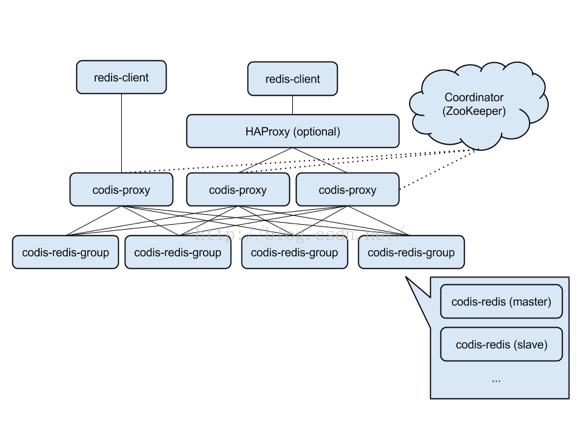

# Redis集群常见解决方案

## 中心化解决方案
中心化解决方案指的是Redis集群除存储节点外，还有一个“Master小集群”负责管理Redis节点，也是比较典型的分布式存储解决方案。目前在业界比较流行的[Codis](https://github.com/CodisLabs/codis)即是中心化集群解决方案，Codis架构图如下：

Codis凭借着容易上手等优点得到很多用户的认可(Coordinatorb包括codies-dashborad、codis-fe，元数据用zk或者etcd存储)。随着业务发展，数据量剧增，Codis也会暴露出一些问题：

##### 集群规模有限
Codis中默认slot数量是1024（开源RedisCluster是16384个slot）。理论上集群中最多只能有1024个数据节点，随着数据量的增长，1024个数据节点显然是不够的。

##### etcd元数据组织冗余
Codis中etcd内维护一个slot与节点之间的映射关系。一般情况下一个数据节点对应若干个slot，slot与节点的组织方式显得冗余（n : 1，如果是数据节点与slot对应，则是1 : n）。如果考虑集群规模的扩展，改用16384（保持与开源redis一致）个slot，冗余数据量加重，后果是推送路由信息给proxy的性能急剧下降，proxy更新路由延迟，影响业务请求。

##### 路由变更降低服务可用性
Proxy内部链接的管理方式以slot为粒度，即一个slot一个连接。如果有路由变更，会逐个slot进行切换。切换过程中proxy使用go语言的[WaitGroup](https://golang.org/pkg/sync/#WaitGroup)等待当前slot的连接上请求处理完毕后，切换slot到新的连接，切换过程可能会新建连接，期间该slot对应的请求都会堵塞导致请求超时，一次扩缩容会切换若干个slot，逐个slot的切换会严重影响服务的SLA（service level agreement）。

## 去中心化解决方案
去中心化是与中心化相对应的，去中心化方案中没有“Master小集群”负责管理Redis节点，Redis节点管理、Failover等完全是集群自治的，典型的解决是官方提供的基于Gossip协议的RedisCluster，详情见前述文章[Gossip协议概述](https://github.com/joeylichang/joeylichang.github.io/blob/master/src/distributed_protocol/gossip/overview.md)。

## 大规模的去中心化解决方案

正如前述文章[Gossip协议概述](https://github.com/joeylichang/joeylichang.github.io/blob/master/src/distributed_protocol/gossip/overview.md)所描述RedisCluster最大的问题是，集群拓扑信息收敛时间随着集群规模线性增长成指数扩大。Amazon S3也是通过Gossip协议管理10w+数据节点，所以这个矛盾并不是没有解决方案。

Amazon S3内部使用Amazon自研的一个基础服务Doxy来管理数据节点，master与Doxy通信获取节点信息并作出裁定和操作（下线、Recover等操作），Doxy是一个基于Gossip协议的服务，由于Amazon S3和Doxy都未开源，它们的更多细节不得而知，但是这种架构还是有一些启发作用的，下面沿着这个思路尝试解决一下上述的矛盾。

Doxy与数据节点通过心跳探测收集节点的信息，节点如果有变更会在Doxy内部通过Gossip协议传播并收敛一致，当收敛一致时推送给master（或者master定期去Doxy拉取）。关于Doxy有几点说明如下：

##### Doxy规模
Doxy的规模远小于数据节点，Doxy只通过心跳与数据节点交互收集少量的元数据，所以节点数不会过多，这样通过Gossip协议传播收敛时间会很短，如[Gossip协议概述](https://github.com/joeylichang/joeylichang.github.io/blob/master/src/distributed_protocol/gossip/overview.md)介绍480数据节点在bj、nj、gz三地域部署收敛时间在5s以内，如果集群规模在几十台可以做到1s内深圳毫秒级别收敛一致，是可以保证高可用的。

##### Doxy可跨地域部署
正如上述跨地域部署数据收敛时间相当可观，对于强一致协议（Paxos、Raft）是望尘莫及的，跨地域网络抖动（常态）强一致协议的性能很那保证，强一致协议一般是3或5个节点扩展到几十台的规模性能更会是问题。Amazon S3是单集群全球部署，显然强一致协议是做不到的。

##### Doxy对数据节点的探活
Doxy对于数据节点是否故障的决策不会取决于Doxy内部某一个节点，一个Doxy节点判断数据节点故障之后会询问通地域其他节点是否也判断该节点故障，多数达成一致后才会在Doxy集群传播。

##### Doxy一个节点不必负责全部数据节点探活
Gossip协议通过传播进行数据收敛，一个Doxy只需要负责一部分数据节点的探活，一个数据节点需要被多个Doxy节点负责，保证了较低概率的误判并且可以在全集群传播，这也能解决跨地域部署的问题（详见下节跨地域部署解决方案）。

##### 总结
用小集群管理大集群，小集群使用Gossip协议保证了集群规模、跨地域部署。

## 跨地域解决方案
跨地域部署指的是一组sharding内主备跨地域部署，而不是跨地域备份部署。社区类产品往往更青睐跨地域部署，例如：知乎、贴吧、百度百科等。社区类产品的特点包括读多写少、必要时可以容忍写失败但不能接受大量读失败。例如，北京用户发帖之后广东用户需要可读，如果帖子热度较高跨地域读取量较大，必然延时较高，跨地域部署可以保证数据在写入成功之后几十毫秒内同步到广东地区保证广东用户读取。社区类产品发帖是一个低频操作，如果发帖写入Redis（未必是帖子的内容写入Reids，可能是元数据或者是热帖的ID等）失败，可以重试（利用消息队列）短时全网用户看不到一两个帖子是可以接受的，但是如果用户读不到多数的帖子是不可以介绍的。跨地域数据方案中全网都写入主地域（sharding内主所在的地域），主地域向其他从地域同步数据（几十毫秒）供本地域的读，可以很好的解决上述两个问题。

集群跨地域部署面临最大的问题是跨地域的网络问题，相对于同地域网络，跨地域网络抖动、网络延时等问题是常态。跨地域部署的常见架构如下：

每个地域一个管理集群，每个地域的管理集群都有一个leader负责汇总其他管理节点的信息（比如，数据节点是否故障，汇总可以理解为计票过程超过半数管理节点认为故障，则判定为故障），每个地域的管理集群只负责管理本地域的数据节点，这样避免了上述的网络问题。每个地域的leader不能做操作（比如，节点下线等），因为每个地域的数据节点只是集群的一部分，一个操作需要考虑全集群的状况，所以全集群需要唯一一个主leader，地域leader将本地域的节点信息汇总之后上报给主leader，主leader汇总全集群数据信息之后做出裁定和操作，主leader可以是某一个地域的leader，但是必须唯一。

## 同城灾备解决方案

同城灾备的目的是保证数据的可靠性在机房或者同城部分区域故障时（机房断电等）保证服务的可用性。常见的架构如下图所示：

主机群proxy对于写请求处理路由给主机群，还会写入消息队列然后消费消息队列中的写请求到备份集群，主备两个集群跨机房或者通地域跨区域部署。当主地域故障时，切换业务请求到备份集群，这种架构需要有以下几点需要考虑：
1. 故障切换时需要有机制保证消息队列中的写请求都被消费完否则有脏数据或者读到过期数据的风险，社区比较活跃的kafka在写入和消费上性能都是比较客观的，但是仍需一定的机制确认消息队列内的写请求被全部消息（或者业务可以容忍一定量写请求的丢失）。
2. 在设计上需要保证消息队列是双向的，如果发生了主备集群切换，备份升级为主，其后的写请求需要同步到消息队列中当旧的主机群恢复时降级为从并能从断点开始消费消费队列内的写请求。

该方案的缺点是不同的proxy上可能有相同Redis节点的请求，proxy写入消息队列的顺序可能和Redis节点收到的顺序不一致，像阿里云等对数据可靠性要求比较的业务，一般选择同步流水（aof）给备份集群，其架构图如下所示：

这种方案不是在proxy层进行同步，而是利用存储节点的binlog写入消息队列。

同城灾备方案保证了机房或者同城部分区域故障是服务的可用性，但是牺牲了成本。之前介绍的跨地域部署方案可以缩减为跨机房或者同城跨区域方案，某个机房或者同城部分区域故障是进行主从切换，也可以做到同城的灾备并且节省了成本，由于reids之间是异步同步机房故障时进行主从切换大概率有数据丢失。

## 热升级解决方案

Redis集群的升级是节点分批升级（停止进程、替换二进制、重启进程），进程的启停过程无法相应用户的请求甚至可能发生主从切换对用户影响可能更大。相对优雅一点的解决方案是先升级sharding内的从节点然后手动发起主从切换（可能保证不丢失），然后在升级新的从节点，同样主从切换也是会影响用户请求的。Redis作为内存的kv存储系统及时是短时的请求失败可能也会对业务有一些影响，比如打垮后端的数据库。

阿里云上的Redis对外宣传可以做到热升级，但是并未开源其内部架构和实现细节，本文尝试提出一种热升级的解决方案。互联网中很多热升级场景都是实用动态加载的方式，即加载动态库（.so结尾的文件）。Redis的热升级同样可以借鉴这种方式，这种方式需要一个RPC框架管理连接、内存等资源，将需要的redis模块（各种数据结构等）编译成动态库，升级时将需要的动态库放在一个目录或者通过版本号区分（注意运行期间的动态库不能直接替换）然后通知框架打开新的链接库，同时方式方式可以是信号或者修改配置通知框架重新加载配位文件，框架内部可以使用双buffer方式dlopen动态库保证切换时刻不影响用户请求。

由于双buffer切换完全是内存操作，切换可以做到瞬间完成，框架负责管理连接和内存保证了对用户连接和数据的无损，从而完成热升级过程。

## 磁盘型Redis解决方案

Redis相对memcache对于业务最具有吸引力的是丰富的数据结构可以支持更多的应用场景，有一些业务即使对性能要求没有那么高但是出于业务场景需要还是选择了Reids，这样就会造成内存资源浪费。磁盘型Redis就应运而生，磁盘型Redis指的是兼容Reids协议的磁盘型KV系统，比如：360的pika、腾讯互娱的Tendis、百度的RedisDB、开源的SSDB等等，他们都针对各自的业务定制化的设计了各自的磁盘型Redis系统。

磁盘型Redis系统在架构上与上述解决方案差别不大，设计的重点在单机的存储引擎上，多数都是基于leveldb或者rocksdb的kv单机存储引擎实现Redis的丰富数据数据结构。leveldb或者rocksdb存储的是kv对于Redis的复杂数据结构和相关命令是不可能做到完全兼容的，大多都是针对各自的业务进行一定的取舍，数据结构的设计网上有很多可以自行Google不在这里重复。磁盘型Redis设计的问题还有很多由于篇幅问题不能详尽也不是本文的重点，下面只针对部分内容展开。

磁盘型存储相比内存单节点存储的数据量至少要大一个量级（这也是节省成本的原因之一），带来的问题是迁移速度慢，由于是磁盘操作、且数据量大迁移过程相比内存Redis会慢很多。可以继续沿用开源Redis的迁移方案按slot粒度分批迁移key。一种加速的方案是直接迁移levelDB或者rockDB的sst文件，迁移过程中为了保证服务可用性还是需要保证正常的写入，那么sst文件就会变更，常见的方式禁止leveldb或者rocksdb在迁移过程压缩合并。

在这里介绍一种可归档的磁盘型Redis架构设计，归档指的是Redis存储的数据可恢复至任意时间点，对于游戏类型的业务是强需求（游戏回档）。可归档到任意时刻的数据需要保存Redis命令的流水（类似开启every-second-aof），可以将流水作为数据存储rocksdb，并定时创建rocksdb的ckpt（check point），归档时需要拉取最近时刻的ckpt以及之后的流水恢复至目标时间的数据。流水的存储和ckpt的文件都会占用大量的存储空间，可以对其压缩转存到其他廉价的存储介质或者其他低成本存储服务中。ckpt的创建与转存以及流水的转存都会消耗一定的系统资源，一个简单的解决方法是将这部分逻辑放在备机处理。

## 混合型存储解决方案

内存Redis适用于对性能要求比较高的业务，磁盘型Redis适用于性能要求不高但是依赖Redis数据结构的业务。往往业务中两者是共存的，即业务数据有热又有冷且依赖Redis的数据结构，混合型存储正是满足这种业务的需求，数据的冷热交个Reids服务做决策，目标是对外性能与内存Redis基本持平，对内实现冷热数据调度。混合型存储解决方案常见的架构有两种：
* 热存储与冷存储严格划分为两个系统，有模块负责冷数据下沉和热数据上浮，proxy路由请求给热存储访问失败后访问冷存储。
	* 优点：架构清晰，方便线上运营。
	* 缺点：冷热数据的上浮和下沉很难准确把握，一旦热存储未命中，请求耗时会加倍，业务现象是请求有抖动，如遇到集群情况服务的平均响应时间像是热存储（目标值）的两倍以上。
* 存储节点包括热存储和冷存储，一个存储节点包括热存储和冷存储
	* 优点：降低业务请求延时的抖动，访问冷数据也在同机处理相对上述方案减少了2次网络交互，减低服务平均延时。
	* 缺点：存储节点设计复杂，较难维护。例如，扩缩容逻辑复杂、且很难保证速度。

## 持久化内存解决方案

相对混合型存储设计的复杂度，NVM既可以保证节省成本（内存的4分之一左右）又可以保证数据的可靠性（掉电不丢失数据），很多大公司都在调研在新硬件上如何应用Redis。
最新的NVM影响是Inter与美光联合研发的新一代非易失性存储器AEP（基于3D-XPoint技术），与之前的DRAM、NVM相比特点包括：
1. 非易失性：与DRAM相比，机器掉电数据不被清空。
2. 物理材料：可堆叠，无晶体管。增大容量的同时节省空间，可以使用DIMM插槽，与DDR4体积相当容量和成本优势明显。
3. 软件层面：可实现字节寻址，使用方式类似内存使用方式。

AEP在使用上分为两种模式：Memory-Mode（使用上等同于内存），App Direct（使用上等同于块设备），这里我们关注App Direct模式，因为他可以保证数据掉电不丢数据（本文讨论的重点）。掉电不丢失数据寻址速度接近内存十分诱人，但是这里面隐藏着一个问题：对于内存如果发生内存使用异常（内存泄露等）重启进程即可恢复运行，AEP掉电之后数据仍保存重启进程更是不会擦除异常数据，所以AEP的使用因硬件的差异与内存还是有区别的。为此Inter提供了pmdk库解决上述问题，pmdk主要提供三种层次的接口：
* 最高层次的接口是事务型接口，即如果写入要么成功要么失败，重启之后数据仍是完整的不会又脏，举个例子reids写数据除了更新数据之外还会修改索引信息等多个操作，如果执行一半掉电重启数据要么是更新前的要不是更新后的不会是只更新数据没更新索引的中间态。
* 中间层次的接口，提供了基本的数据结构，例如队列、栈、树等数据结构是非事务型的，供业务逻辑使用。
* 最低层次的家口，提供了类似字符串操作的接口，不保证书屋。

通过上面的介绍，可以看出最高层次的接口是最友好的但是性能也是最差的100B数据的写入是内存的40倍这显然是不能接受的，最低层次的接口性能最好的接近内存的性能但是不满足持久化的需求。
目前业界针对NVM的Redis还没有大量铺开，很多公司都是实验性的调研，目前只有阿里云对外公布了一些细节《[阿里云基于NVM的持久化高性能Redis数据库]》(https://yq.aliyun.com/articles/621212)，方案整体思路如下：
* 优化写操作
	* 引擎分为两层，一层在内存中（AEP设备数据的缓存），一层在AEP设备上（全量数据）。
	* 写请求判断内存中是否有数据，有则直接更改，否则从AEP引擎中读出数据然后更改，最后写aof（aep设备）。
	* 异步读取aof，事务型写入AEP引擎。
* 读操作：写读内存引擎，如果存在直接读取，否则读AEP引擎。

PMDK对于事务型写的性能较差，但是使用最底层的读操作性能却几乎与内存出不多，AEP整体表现为读写部队称，上述方案根据通过缓存和异步消费aof来拟补读写的不对称。文章中也之处一些不足，对于高写入场景消费aof的速度跟不上内存落盘的速度，failover之后需要等待内存"预热“之后才能提供服务。
