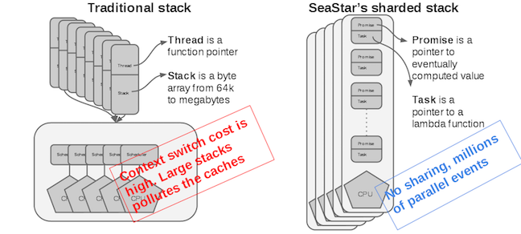

# seastar介绍

## seastar前世今生
seasatr虽然是一个高性能的RPC框架，不过它的诞生渊源最早可以追溯到Google BigTable 和 Amazon DynamoDB。Avinash Lakshman是DynamoDB的作者之一，之后在Facebook主持开发了Cassandra，Cassandra主要用于储存收件箱等简单格式数据，于2008年开源交给Apache基金会管理。Cassandra在数据模型上参考了Google BigTable，在分布式架构上参考了Amazon DynamoDB，Amazon DynamoDB（后续介绍）可以很好的支持集群规模变化。Cassandra由java编写存在GC问题，KVM作者Avi Kivity创办Scylla公司开源[scylladb](https://www.scylladb.com/)，scylladb完全兼容Cassandra接口。为了进一步提升scylladb性能，Avi Kivity团队针对现代计算机体系结构开发了新的RPC框架——seastar。

## seastar特点
seastar针对提升性能和使用做了以下几点设计：

1. 充分利用多核：seastar在每个CPU核上都绑定了一个协作调度器。每个每个微任务（lambda）都是非常轻量级的，仅仅是处理上一次IO操作返回的结果，一般完成后又提交一个新的任务。
2. 充分利用SMP架构：每个CPU核都是完全独立的，它们之间不共享内存、数据结构和CPU时钟。跨CPU核的通信必须显式的使用消息传递。
3. 用户态网络协议栈（可选）：seastar可以使用操作系统的TCP栈，但它也提供了自己的高性能TCP/IP协议栈（DPDK，virtio，Xen，vhost），这样就可以从TCP栈的缓存里面直接处理数据，并直接发送自己的数据，实现零拷贝。
4. 基于DMA的存储APIs：类似网络协议栈，seastar也提供了零拷贝的存储APIs。
5. [Promise-Futures](https://en.wikipedia.org/wiki/Futures_and_promises)编程模型：通过串联Futures的方式避免了异步回调编程带来的复杂度。

## seastar设计
seastar的网络线程模型图如下：

seastar与brpc一样没有区分网络I/O、CPU、磁盘I/O线程，根据请求落在的Core三者共用一个线程，避免了cache一致性导致的性能损耗，可以做到性能随着Core的增加成线性增长。每个Core上的主逻辑运行的是拆分后的Fetures链（可以理解为协程中的子任务遇到堵塞，则会切换其他的子任务）。
seastar的内存设计理念是share nothing，给每个Core分配足够的内存（无需锁提升性能），框架禁止跨核数据拷贝（通过消息实现）。

##### 线程模型
seastar在启动时每个Core创建并绑定三个线程：
1. reactor线程基于epoll，执行代码主逻辑（Fetures链）。
2. timer线程定时向reactor发送一个signal触发软中断，检查reactor是否在一个函数中长时间执行，用于发现死循环。
3. syscall线程主要执行无法异步化的函数，比如open，sync。

##### 跨核同步
seastar的设计理念是share nothing，跨核时通过消息来做同步（submit_to）。

##### 内存管理
seastar使用自定义内存分配器，首先使用mmap向系统申请16T的虚拟内存占用，并用madvise告诉内核这16T虚拟地址不分配物理页，不可读写。然后每一个CPU从其中划出来一块虚拟地址空间，用madvise为其分配物理页，并独占使用。Future之间共享数据对象，为了避免繁琐管理（何时析构内存数据）共享指针自然是一种方式。

##### 网络模型
seastar在每个CPU都需要执行listen和accept，但是只有CPU 0是真正调用系统函数的。在产生新的链接时，CPU 0会根据每个CPU当前连接数动态分配fd实现负载均衡。

#### 磁盘I/O
seastar的文件IO采用Linux AIO + direct IO方式，DIO需要内存按照512对齐按块写入等要求，seastar会调用truncate把文件调整到相应的大小。

## 总结
seastar最大的优点是高性能，具体原因前面已有介绍。下面总结一下seastar的节点不足：

1. 如果任务分配不均，将会出现某一个cpu工作负载过高，而其他cpu相对空闲的情况。
2. 共享指针看似方便，但也使内存的ownership变得难以捉摸，如果内存泄漏了，很难定位哪里没有释放。如果segment fault了，也不知道哪里多释放了一下。大量使用引用计数的用户代码很难控制代码质量，容易长期在内存问题上耗费时间。
3. seastar对DPDK的支持不够全面，比如seastar不支持DPDK的bond网卡。需要注意的是，如果使用seastar的用户态协议栈，很多Linux系统自带的网络工具将失效（例如netstat命令）给线上问题定位带来了不便。
