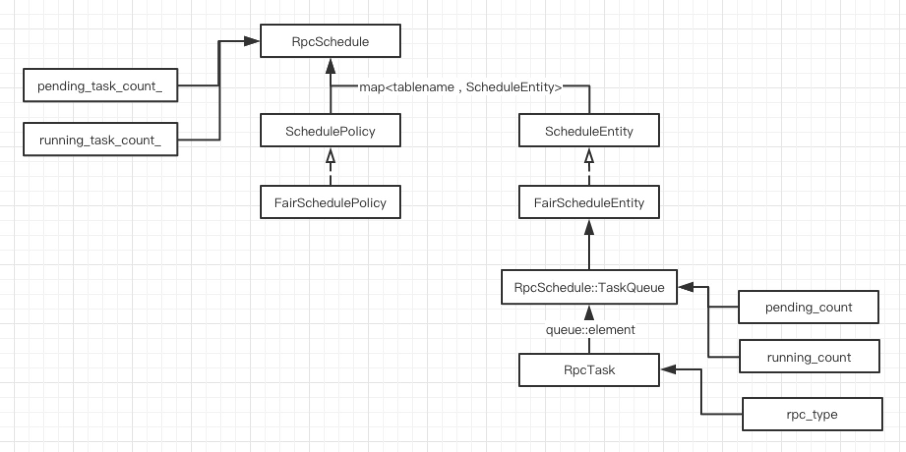

# TabletNode RPC

### RemoteTabletNode

RemoteTabletNode负责TabletNode RPC的远程调用逻辑。先看一下其重要的成员变量：

```c++
TabletNodeImpl* tabletnode_impl_;     // rpc层做一些校验限流逻辑之后会调用其相应接口完成操作
scoped_ptr<ThreadPool> ctrl_thread_pool_;  // loadtablet、unloadtablet 在任务较多是使用这个线程池，默认20个线程
scoped_ptr<ThreadPool> lightweight_ctrl_thread_pool_;  // loadtablet、unloadtablet 任务不重 或者 query、CmdCtrl、computespilt、updat使用的线程池 默认 10个线程
scoped_ptr<ThreadPool> write_thread_pool_;  // 写请求的线程池 默认10个线程
scoped_ptr<ThreadPool> read_thread_pool_;   // 读请求的线程池 默认40个线程
scoped_ptr<ThreadPool> scan_thread_pool_;   // scan请求的线程池 默认30个线程
scoped_ptr<ThreadPool> compact_thread_pool_;// 压缩请求的线程池 默认30个线程
scoped_ptr<RpcSchedule> read_rpc_schedule_; // read rpc的调度侧率（一种排队算法，见后面介绍）
scoped_ptr<RpcSchedule> scan_rpc_schedule_; // scan rpc的调度侧率（一种排队算法，见后面介绍）
scoped_ptr<RpcSchedule> quota_retry_rpc_schedule_; // quota rpc的调度侧率（一种排队算法，见后面介绍）

enum TabletCtrlStatus {
  kCtrlWaitLoad = kTabletWaitLoad,
  kCtrlOnLoad = kTabletOnLoad,
  kCtrlWaitUnload = kTabletWaitUnload,
  kCtrlUnloading = kTabletUnloading,
};

std::mutex tablets_ctrl_mutex_;   // 未使用
std::map<std::string, TabletCtrlStatus> tablets_ctrl_status_;  // path -> table load/unload状态 用于选择lightweight_ctrl_thread_pool_ 或者 ctrl_thread_pool_ 使用

std::unique_ptr<auth::AccessEntry> access_entry_;  // 权限校验
std::shared_ptr<quota::QuotaEntry> quota_entry_;   // quta模块
```

### RPC的调度策略



TableServer 的读、Scan、Quta请求的调度策略都是相同的，类图及重要的类成员变量如上图所示。

整个调度的策略，在RPC远程调用做一下队列的缓冲。

1. RpcSchedule内部维护typedef std::map<TableName, ScheduleEntity*> TableList; 既表名 -> rpc请求队列（read、scan、quota是三个RpcSchedule）。
2. ScheduleEntity是队列中的一个节点，内部有一个指针指向队列头。
3. RpcSchedule 维护三个重要接口EnqueueRpc、DequeueRpc、FinishRpc。
4. 请求进来后调用EnqueueRpc，加入threadpool进行调度，在回调中调用DequeueRpc 根据FairSchedulePolicy选择队列中的FairScheduleEntity进行执行，执行完调用FinishRpc。
5. 整个生命流程中维护RpcSchedule 的 成员变量，pending_task_count_、running_task_count_，以及task_queue的pending_count、running_count 以及 FairScheduleEntity的last_update_time、elapse_time、running_count。
   1. 注意上面维护的统计变量的维度，包括RpcSchedule维度、表维度、RPC维度。
6. FairSchedulePolicy维护Pick、Done、Enable、Disable、UpdateEntity五个接口。
   1. Pick：